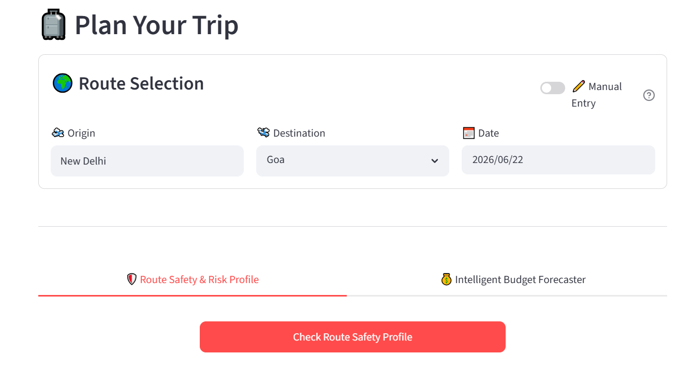

<h1 align="center"># 🛡️ SafeTravels ML Engine</h1>


### Real-Time Travel Risk Prediction · FastAPI + Streamlit + Scikit-Learn

[](https://www.python.org/)
[](https://fastapi.tiangolo.com/)
[](https://streamlit.io/)
[](https://scikit-learn.org/)
[](https://render.com/)
[](https://dixit-072-safetravels-ml-engine-frontendapp-streamlit-lzmyho.streamlit.app/)

**SafeTravels** is an end-to-end ML pipeline that predicts real-time travel risk scores (0–100%) by fusing live meteorological data with geographical terrain analysis. Enter any destination, and the system fetches live weather telemetry, runs it through a trained classifier, and returns a deterministic hazard rating with travel advisories.

---

## 🚀 Live Demo

> **[▶ Try the Live Dashboard](https://dixit-072-safetravels-ml-engine-frontendapp-streamlit-lzmyho.streamlit.app/)**

---

## 📸 App Preview



---

## 📸 What It Does

| Input | Processing | Output |
|---|---|---|
| Destination city | Fetches live weather via Open-Meteo API | Risk score (0–100%) |
| Travel date | Applies terrain-aware feature engineering | Hazard classification |
| Terrain type | Runs Scikit-Learn ML classifier | Safe travel recommendations |

**Sample output for Shimla:**
- Precipitation: `12.44 mm` → daily accumulated sum (not instantaneous)
- Wind: `12.6 km/h` | Temperature: `5.0°C`
- Terrain: High-Altitude Mountain Pass (elevation penalty applied)
- **Predicted Risk: 95% 🚨 Critical Hazard**

---

## 🏗️ System Architecture

```
┌─────────────────────────────────┐
│   Streamlit Frontend (Cloud)    │  ← User enters destination + date
└────────────────┬────────────────┘
                 │ HTTP POST (JSON)
                 ▼
┌─────────────────────────────────┐
│   FastAPI Backend (Render)      │  ← Loads trained .pkl model
└────────┬───────────────┬────────┘
         │               │
         ▼               ▼
┌──────────────┐  ┌──────────────────────┐
│ Open-Meteo   │  │ ML Inference Engine  │
│ Weather API  │  │ (Scikit-Learn)       │
│ (Live Data)  │  │ Risk Score Output    │
└──────────────┘  └──────────────────────┘
```

**Decoupled microservice design** — backend and frontend deploy independently, keeping inference fast and the UI always available.

---

## ⚙️ Key Engineering Features

**Daily Precipitation Aggregation**
Fetches `precipitation_sum` (full-day accumulated rainfall) instead of instantaneous readings — critical for capturing mountain monsoons and cloudburst events that spike and subside within hours.

**Terrain-Aware Feature Engineering**
Dynamically injects elevation penalties based on destination terrain class (High-Altitude Pass, Semi-Arid Plains, Coastal, etc.), making risk scores geography-aware rather than weather-only.

**Fault-Tolerant API Handling**
If Open-Meteo returns null or misaligned values, the backend intercepts cleanly and applies mathematical fallbacks — no UI crashes from bad telemetry.

**Reproducible Predictions**
Seeds the NumPy RNG from a hash of destination + date combination, ensuring identical inputs always return identical risk scores across sessions.

---

## 🛠️ Tech Stack

| Layer | Tech |
|---|---|
| ML & Data | Scikit-Learn, Pandas, NumPy, Pickle |
| Backend API | FastAPI, Uvicorn, Pydantic |
| Weather Data | Open-Meteo API |
| Frontend | Streamlit |
| Backend Hosting | Render (free tier) |
| Frontend Hosting | Streamlit Community Cloud |

---

## 📁 Project Structure

```
safetravels-ml-engine/
├── backend/          # FastAPI app, ML model loading, prediction routes
├── frontend/         # Streamlit dashboard (app_streamlit.py)
├── models/           # Trained .pkl model files
├── src/              # Feature engineering, preprocessing utils
├── data/             # Raw and processed datasets
├── notebooks/        # EDA and model training notebooks
├── analysis/         # Risk analysis scripts
├── store_user_query/ # Query logging module
├── tests/            # Unit tests
├── requirements.txt
└── run_pipeline.bat  # One-click local pipeline runner (Windows)
```

---

## 💻 Local Setup

```bash
# 1. Clone the repo
git clone https://github.com/dixit-072/safetravels-ml-engine.git
cd safetravels-ml-engine

# 2. Create and activate virtual environment
python -m venv venv
venv\Scripts\activate        # Windows
# source venv/bin/activate   # macOS/Linux

# 3. Install dependencies
pip install -r requirements.txt

# 4. Start the FastAPI backend (Terminal 1)
uvicorn backend.routes:app --reload --port 8000

# 5. Launch the Streamlit frontend (Terminal 2)
streamlit run frontend/app_streamlit.py
```

Or on Windows, run `run_pipeline.bat` to start both services at once.

---

## 🔮 Roadmap

- [ ] **Dynamic Geocoding** — Replace hardcoded terrain dictionaries with live OpenStreetMap API for any city globally
- [ ] **Historical Risk Tracking** — Persist query logs to a cloud database for trend analysis over time
- [ ] **Multi-Day Forecast Mode** — Extend predictions across a 7-day travel window
- [ ] **Route Risk Mapping** — Visualize risk scores on an interactive map for full journey planning

---

## 👨‍💻 Author

**Dixit Sharma** — Data Analyst | ML Engineer

[](https://www.linkedin.com/in/dixit-data-analyst)
[](https://github.com/dixit-072)
[](https://dixit-072-safetravels-ml-engine-frontendapp-streamlit-lzmyho.streamlit.app/)
